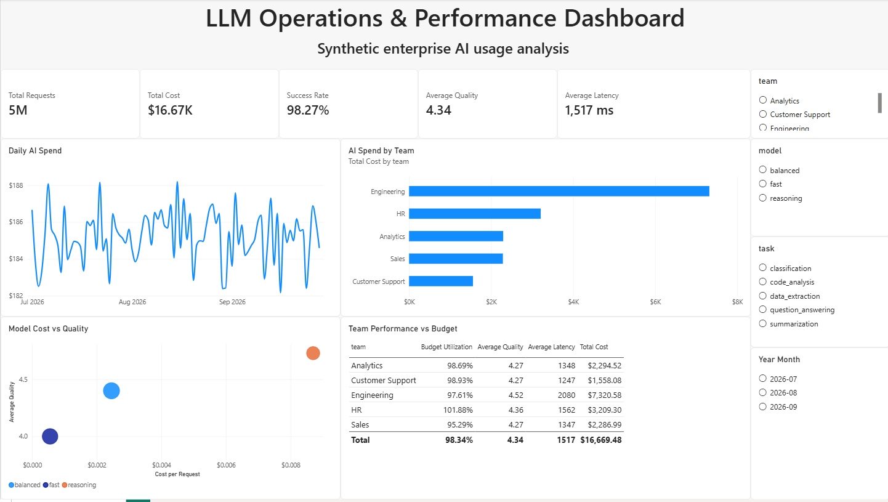
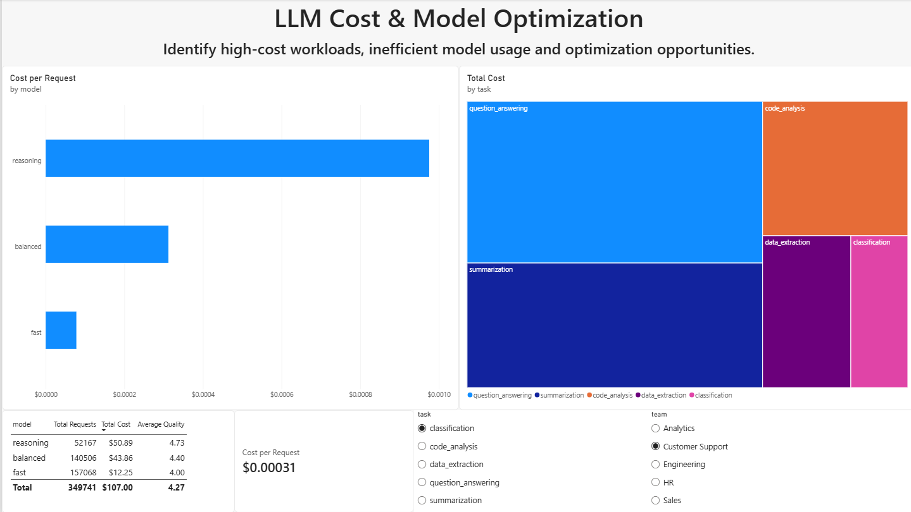
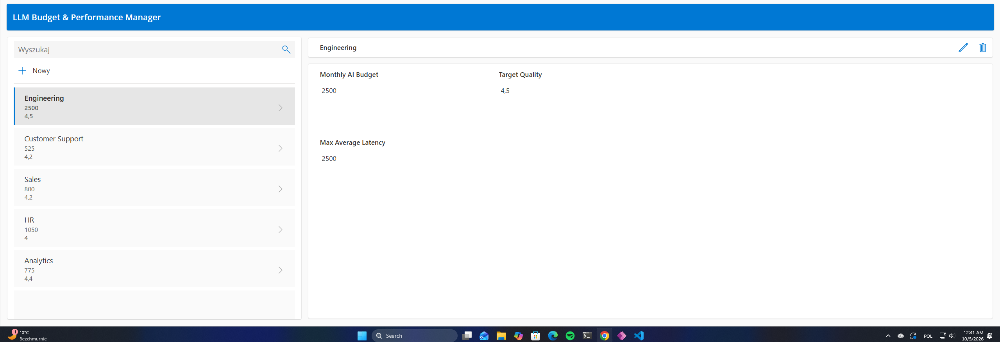

# LLM Operations & Performance Analytics

End-to-end analytics project for monitoring enterprise LLM usage, cost, quality, latency, reliability, and team-level budget performance.

> **Important:** The dataset used in this project is fully synthetic. It does not contain production OpenAI telemetry or data from a real company.

## Project goal

The project simulates how an organization could monitor and optimize internal LLM usage across several business teams.

The analytical questions include:

- Which teams generate the highest AI spend?
- How do model cost, latency, and quality differ?
- Which workloads create the largest cost?
- Which teams are close to or above their monthly AI budget?
- Where could model-routing policies potentially reduce cost without a major loss in quality?

## Tech stack

- **Python** — synthetic data generation
- **Pandas / NumPy** — data preparation
- **Microsoft SQL Server 2022** — staging and analytical storage
- **Docker** — reproducible local SQL Server environment
- **Power Query** — reporting-layer transformations
- **Power BI** — semantic model, DAX measures, dashboards
- **Power Apps** — Canvas App for managing team-level AI budgets and performance targets
- **Microsoft Lists / SharePoint** — business-managed storage for team budgets and target values

## Architecture

```text
Python synthetic data generator
            |
            v
       CSV - 5M rows
            |
            v
      MS SQL Server
            |
            v
       Staging table
            |
            v
  SQL validation / typing
            |
            v
      Analytical table
            |
            v
       Power Query
            |
            v
    Power BI data model
            |
            v
        Dashboards


Power Apps
    |
    v
Microsoft Lists / SharePoint
    |
    v
Team budgets & performance targets
```

The Power Apps component provides a lightweight business interface for maintaining team-level budget and performance targets. Microsoft Lists / SharePoint acts as the editable business-data layer for these settings.

## Dataset

The generator creates **5,000,000 synthetic LLM API usage events** across:

- Engineering
- Customer Support
- Sales
- HR
- Analytics

Each record represents one simulated API request and contains:

- timestamp
- team
- task
- model class
- input tokens
- output tokens
- latency
- success status
- quality score
- estimated API cost

The three model classes are deliberately generic:

- `fast`
- `balanced`
- `reasoning`

They are not intended to represent specific commercial OpenAI models.

The synthetic data is designed to reproduce realistic analytical relationships, such as higher model quality being associated with greater cost and latency.

## SQL pipeline

The SQL layer uses a staging pattern:

```text
raw CSV
   |
   v
AIUsage_Staging
   |
   v
validation + type conversion
   |
   v
AIUsage
```

This allows raw string values such as boolean fields and scientific-notation numeric values to be validated before they enter the analytical table.

The SQL scripts are located in [`sql/`](sql/):

1. `01_create_schema.sql`
2. `02_load_staging.sql`
3. `03_transform.sql`
4. `04_create_budgets.sql`

## Power BI model

The report uses:

- `FactAIUsage`
- `DimTeamBudget`
- `DimDate`

Core DAX measures include:

- Total Requests
- Total Cost
- Cost per Request
- Average Quality
- Average Latency
- Success Rate
- Total Tokens
- Budget Utilization
- Budget for Selected Period

## Dashboards

### Executive Overview

The first page provides an executive view of LLM operations:

- total request volume
- total AI spend
- success rate
- average quality
- average latency
- daily spend
- spend by team
- cost-quality trade-off
- team budget utilization



### LLM Cost & Model Optimization

The second page focuses on optimization opportunities:

- cost per request by model
- AI spend by workload
- model performance comparison
- task-level and team-level drill-down



## Power Apps — LLM Budget & Performance Manager

A lightweight **Power Apps Canvas App** was created to manage team-level AI budget and performance targets.

The application allows users to:

- browse business teams,
- update monthly AI budgets,
- update target quality values,
- update maximum acceptable average latency,
- save changes back to Microsoft Lists / SharePoint.

The app uses the `AI Team Budgets` Microsoft List as its data source.

Example managed fields:

| Field | Description |
|---|---|
| `Team` | Business team |
| `MonthlyBudgetUSD` | Monthly AI budget in USD |
| `TargetQuality` | Target quality score |
| `MaxAvgLatencyMs` | Maximum acceptable average latency |

Add the final screenshot here:

```md

```

Recommended repository structure:

```text
powerapps/
├── README.md
├── LLM_Budget_Performance_Manager.msapp   # optional, if exported
└── screenshots/
    └── budget-manager-overview.png
```

## Business insights

Based on the generated dataset and the current dashboard:

1. **Engineering is the largest AI cost driver**, responsible for approximately 44% of total simulated spend.
2. **Reasoning models achieve the highest average quality**, but at a substantially higher cost per request than balanced and fast models.
3. **Balanced models represent a potential cost-quality compromise** for workloads that do not require the maximum reasoning capability.
4. **HR slightly exceeds its simulated budget**, while the remaining teams stay close to their allocated limits.
5. **Model-routing optimization is a potential cost-reduction opportunity**: selected low-complexity workloads may be candidates for migration from reasoning to balanced or fast models, subject to quality validation.

Because the dataset is synthetic, these insights demonstrate the analytical workflow rather than make claims about real-world OpenAI usage.

## Reproducing the project

### 1. Create a Python environment

Linux / WSL:

```bash
python3 -m venv .venv
source .venv/bin/activate
pip install -r requirements.txt
```

### 2. Generate the synthetic dataset

```bash
python generate_data.py
```

This creates:

```text
ai_usage_logs.csv
```

The generated CSV is intentionally excluded from Git because it contains 5 million rows and can be recreated locally.

### 3. Configure SQL Server

Copy the environment template:

```bash
cp .env.example .env
```

Edit `.env` and set a local SQL Server password:

```text
MSSQL_SA_PASSWORD=your-local-password
```

Never commit `.env`.

Start SQL Server:

```bash
docker compose up -d
```

### 4. Run the SQL pipeline

Export the same password in the shell:

```bash
export MSSQL_SA_PASSWORD="your-local-password"
```

Then run:

```bash
bash run_sql_pipeline.sh
```

### 5. Connect Power BI

Connect Power BI Desktop to the SQL Server instance.

Typical connection:

```text
Server: <WSL-IP>,1433
Database: AIAnalytics
Authentication: Database
User: sa
```

Depending on the Windows/WSL networking configuration, `localhost,1433` may also work.

Load:

- `dbo.AIUsage`
- `dbo.TeamBudgets`

Do not load the staging table into the report.

### 6. Power Apps / Microsoft Lists

Create or use a Microsoft List named:

```text
AI Team Budgets
```

with the following fields:

```text
Team
MonthlyBudgetUSD
TargetQuality
MaxAvgLatencyMs
```

Use the list as the data source for the Power Apps Canvas App.

## Repository structure

```text
llm-operations-performance-analytics/
│
├── README.md
├── generate_data.py
├── requirements.txt
├── docker-compose.yml
├── run_sql_pipeline.sh
├── .gitignore
├── .env.example
│
├── sql/
│   ├── 01_create_schema.sql
│   ├── 02_load_staging.sql
│   ├── 03_transform.sql
│   └── 04_create_budgets.sql
│
├── powerbi/
│   └── LLM_Operations_Performance.pbix
│
├── powerapps/
│   ├── README.md
│   ├── LLM_Budget_Performance_Manager.msapp
│   └── screenshots/
│       └── budget-manager-overview.png
│
└── screenshots/
    ├── executive-overview.png
    └── optimization-opportunities.png
```

## Repository notes

The following files should **not** be committed:

- generated CSV files
- `.env`
- `.venv`
- credentials
- temporary Power BI files

The `.pbix` report should be stored in `powerbi/` if its file size is suitable for GitHub. If it exceeds GitHub's normal single-file size limit, use Git LFS or publish only the code, documentation, and screenshots.
